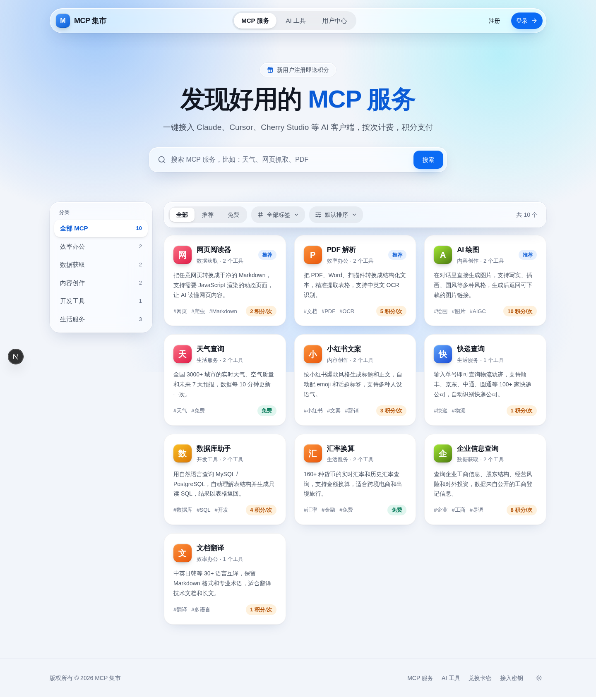
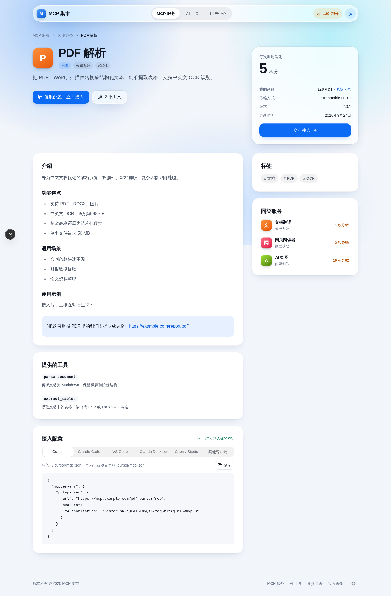
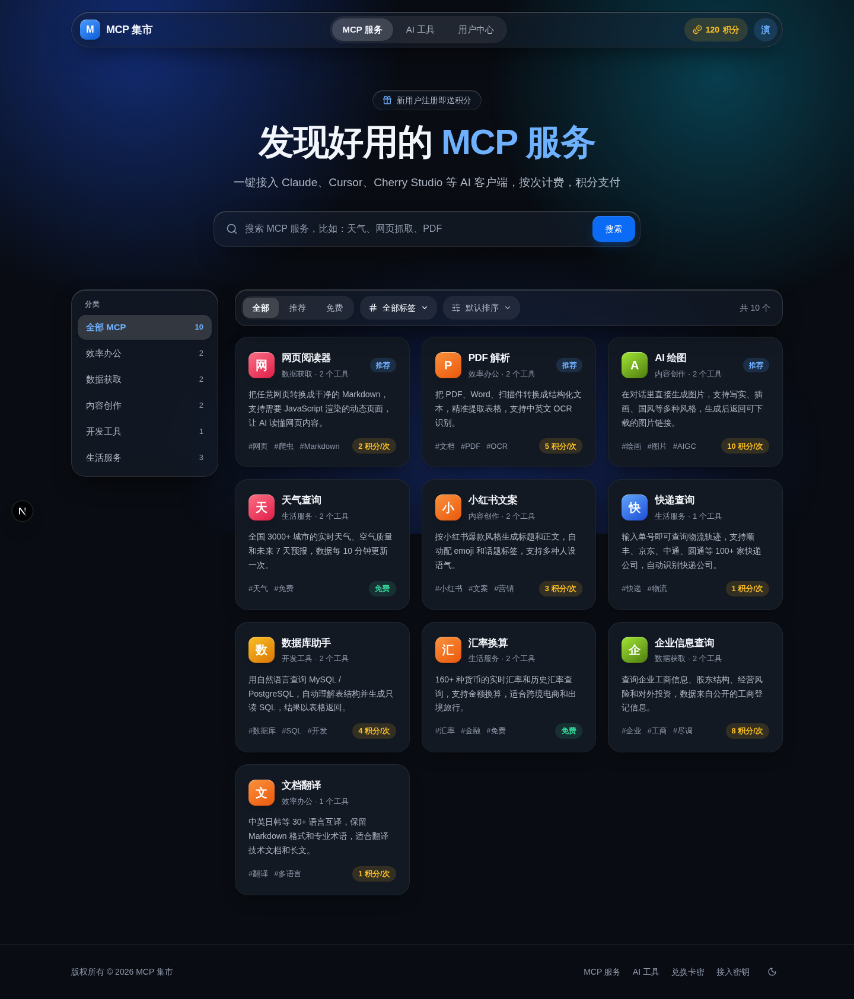
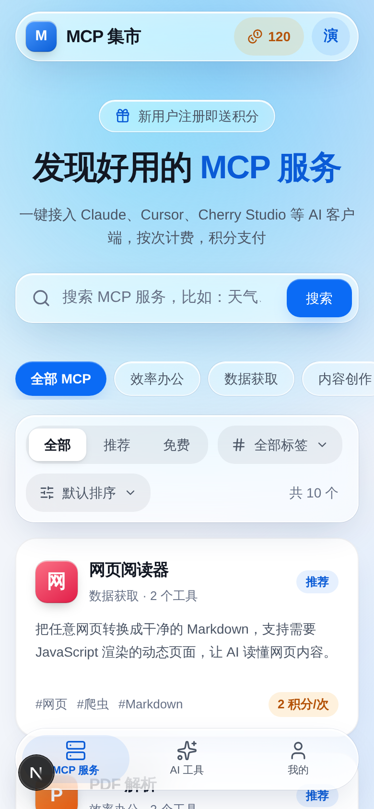

# MCP 集市

一个展示和售卖自家 MCP 服务、在线 AI 工具的门户站，风格参考 mcp.so。

- **首页**：MCP 服务卡片墙，支持分类、标签、搜索、筛选、排序
- **MCP 详情页**：介绍、工具列表、价格，以及 Cursor / Claude Code / VS Code / Claude Desktop / Cherry Studio 等客户端的接入配置（登录后自动填入用户密钥，一键复制）
- **AI 工具页**：AI 音乐、绘画、配音等在线工具的卡片墙和详情页
- **用户中心**：积分余额、接入密钥、卡密兑换、积分记录
- **管理后台** `/admin`：上架产品、管理分类和用户、修改站点设置，全中文界面

| 首页 | MCP 详情页 |
|---|---|
|  |  |

更多截图见 [docs/screenshots](docs/screenshots)。

## 设计

蓝白主色 + 静态毛玻璃，参照 iOS 27 的层级原则：玻璃只用在浮起来的导航层（导航栏、搜索、筛选、价格卡、手机底栏），卡片和正文保持实心。颜色、材质、圆角等规范见 [docs/design.md](docs/design.md)。

| 深色模式 | 手机 |
|---|---|
|  |  |

## 技术栈

- [Payload CMS 3](https://payloadcms.com)：管理后台、账号登录、数据存储（MIT）
- [Next.js 16](https://nextjs.org) + React 19：前台页面，和后台在同一个项目里
- Tailwind CSS v4 + [shadcn/ui](https://ui.shadcn.com)
- 前台界面改编自 [Mkdirs](https://github.com/MkThingsHQ/mkdirs)（Apache 2.0），详见 [THIRD_PARTY_NOTICES.md](THIRD_PARTY_NOTICES.md)
- 数据库默认 SQLite，不用额外装数据库

## 本地运行

需要 Node.js 20 以上和 pnpm。

```bash
cp .env.example .env      # 然后把 PAYLOAD_SECRET 改成随机字符
pnpm install
pnpm seed                 # 写入示例数据和默认账号
pnpm dev
```

打开：

- 前台：http://localhost:3000
- 后台：http://localhost:3000/admin

`pnpm seed` 创建的账号（上线前务必修改密码）：

| 账号 | 密码 | 用途 |
|---|---|---|
| admin@example.com | admin123456 | 管理员，可登录后台 |
| demo@example.com | demo123456 | 演示用户，带 120 积分 |

没有运行 `pnpm seed` 的话，第一次打开 `/admin` 会让你创建账号，第一个账号自动成为管理员。前台注册的用户永远是普通用户。

## 日常操作

- **上架 MCP 服务**：后台 → 产品 → MCP 服务 → 新建。填名称、一句话介绍、详细介绍（支持 Markdown，可直接粘贴 README）、提供的工具、远程 MCP 地址和每次调用消耗的积分。英文短名会用在网址和客户端配置里。
- **上架 AI 工具**：后台 → 产品 → AI 工具 → 新建，填工具地址和每次使用消耗的积分。
- **下架**：把状态改成“已下架”，前台立即看不到。
- **排序和推荐**：勾选“推荐”会排在前面并带标记；“排序”数字越小越靠前。
- **首页文案、注册赠送积分、购买卡密链接、ICP 备案号**：后台 → 设置 → 站点设置。

## 常用命令

| 命令 | 作用 |
|---|---|
| `pnpm dev` | 本地开发 |
| `pnpm build` / `pnpm start` | 生产构建 / 启动 |
| `pnpm seed` | 写入示例数据（已有数据会跳过） |
| `pnpm lint` / `pnpm typecheck` | 代码检查 / 类型检查 |
| `pnpm test:int` | 运行测试 |
| `pnpm generate:types` | 修改数据模型后重新生成类型 |

## 目录结构

```
src/
├── app/(frontend)/     前台页面：首页、/mcp/[slug]、/tools、登录注册、/console
├── app/(payload)/      Payload 管理后台和 REST API（自动生成，一般不用改）
├── collections/        数据模型：MCP 服务、AI 工具、分类、用户、图片
├── globals/            站点设置
├── components/         前台组件（listing 列表、detail 详情、layout 导航页脚、ui 基础组件）
├── lib/                数据查询、客户端配置生成、工具函数
└── seed/               示例数据
```

## 进度

- [x] 前台：MCP 首页、详情页、AI 工具页、登录注册、用户中心
- [x] 蓝白毛玻璃设计：浅色 / 深色、电脑 / 手机
- [x] 后台：产品上架、分类、用户、站点设置
- [ ] 卡密：批量生成、导出、兑换，积分流水
- [ ] 积分扣减接口：给 MCP 网关和 AI 工具调用，按次扣积分
- [ ] 部署方案
